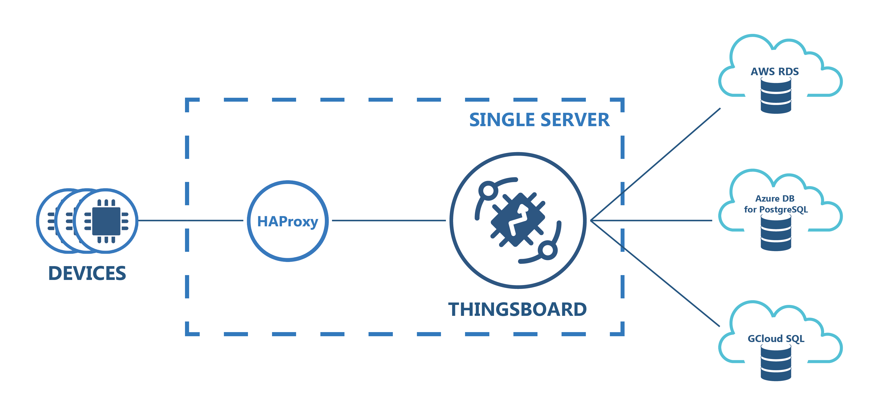
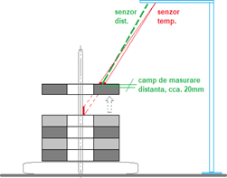

# Portfolio
---
## Monitoring, Controlling and Cost Management of Energy, Water and Gas consumption

### IoT Solution by LoRaWAN for [***McDonald’s restaurants***](https://www.mcdonalds.ro/restaurante)

We have been working on a proof of concept since last year. McDonald's was offered a way to reduce their energy consumption. They also consume other things like water, gas, etc. We installed the LoRaWAN network in one of their restaurants. We initially used five Eastron energy meters to collect different energy-related data and observe the average consumption over twenty-four hours. We set a threshold that if the energy consumption is more than the set limit, it will create a notification and send it by mail. By getting this notification, customers will be informed about their unnecessary consumption. They can save 15% to 20% on their total energy costs this way. We use the famous IoT platform Thingsboard and LoRaWAN based sensors. This year they approved our proof of concept, and we are now working with their other restaurants in Romania.

 

 

---
### Datalogging with ChirpStack, Node-RED, InfluxDB, Grafana using Docker Container

I build a local solution for our customers without relying on cloud computing. First, I installed the ChirpStack network server, Node-RED, Influx DB & Grafana as Docker containers on the Dell server. I create a database in InfluxDB. Using this database, I connect the Grafana web application which is the open-source analytics and monitoring solution for every database. I use a microtik gateway to forward all sensor values to the ChirpStack network server. Node-RED collects data from NS through a topic provided by ChirpStack. After collecting those values I forward them to the InfluxDB database. By using these data, I built a simple web dashboard in Grafana to visualize the values in graphs, charts, and alerts for notification of critical situations.

 

 

---
### Advantech LoRaWAN WISE-6610 gateway and WISE-2410 wireless condition monitoring sensor solution

For predictive maintenance, I used WISE-2410 to transmit sensor data to WISE-6610 (via LoRaWAN) or a 3rd party LoRaWAN gateway (via LoRaWAN). WISE-6610 provides Ethernet connectivity and supports Modbus TCP, RESTful Web API for integration. The WISE-6610 allows for VPN tunnel creation with various protocols that ensure safe communication. It also provides a network server that can encrypt and convert LoRaWAN data in the device, and its redundancy-enhanced functions are specifically designed to prevent connection loss. It has an inbuilt application server. Using this application server, I built a dashboard in Node-RED to visualize the WISE-2410 values.

 

 

---
## DataBase

### Deploy PostgreSQL fully manageable database for Thingboard

ThingsBoard uses the database to store entities (devices, assets, customers, dashboards, etc) and telemetry data (attributes, timeseries sensor readings, statistics, events). In this project, I am preparing to deploy a PostgreSQL fully managed database. PostgreSQL is a free and open-source object-relation database management system (ORDBMS). ThingsBoard customers successfully use Azure Database for PostgreSQL to minimize efforts on database setup, backups and support.

 

 

---
### TEMPERATURE-MEASUREMENT-OF-SHEET-PACKAGES-AT-AXLE-ASSEMBLY

We have done a temperature measurement project for Cummins Generator Technologies Romania SA. During this project, we need to read the temperature range of the electric rotor between 100 °C and 200 °C. We use two sensors one is the position/distance sensor, and another one is the temperature sensor. When each rotor passes through the rays of the position/distance sensor, the temperature is checked. The green lamp illuminates when the temperature level is in the set range. In addition, the PLC logs data while the HMI shows the values.

 

---
### CAR RACING GAME BASED ON SCRATCH PROGRAMMING

<!-- 
We have done a temperature measurement project for Cummins Generator Technologies Romania SA. During this project, we need to read the temperature range of the electric rotor between 100 °C and 200 °C. We use two sensors one is the position/distance sensor, and another one is the temperature sensor. When each rotor passes through the rays of the position/distance sensor, the temperature is checked. The green lamp illuminates when the temperature level is in the set range. In addition, the PLC logs data while the HMI shows the values.
 -->

---

<!-- ### Kaggle Competition: Predict Ames House Price using Lasso, Ridge, XGBoost and LightGBM

I performed comprehensive EDA to understand important variables, handled missing values, outliers, performed feature engineering, and ensembled machine learning models to predict house prices. My best model had Mean Absolute Error (MAE) of 12293.919, ranking <b>95/15502</b>, approximately <b>top 0.6%</b> in the Kaggle leaderboard.

 

 

---
### Predict Breast Cancer with RF, PCA and SVM using Python

In this project I am going to perform comprehensive EDA on the breast cancer dataset, then transform the data using Principal Components Analysis (PCA) and use Support Vector Machine (SVM) model to predict whether a patient has breast cancer.

 

 

---
### Business Analytics Conference 2018: How is NYC's Government Using Money?

In three-month research and a two-day hackathon, I led a team of four students to discover insights from 6 million records of NYC and Boston government spending data sets and won runner-up prize for the best research poster out of 18 participating colleges.

 

 
--- -->
  
## Filmed by me

Beside Engineering, I have a great passion for photography and videography. Below is a list of the videos I have created for sharing my knowledge.

 

- [How to install Node-RED on Ubuntu 20.04 with username and password authentication??](https://www.youtube.com/watch?v=Y2ttfN9mOyQ&t=10s)
- [Enable SSH on Ubuntu 20.04 step-by-step instruction and connect by Putty.](https://www.youtube.com/watch?v=_Rt7UzRbeV8)

---

© 2022 Ariful Islam Arif. Powered by Jekyll and the Minimal Theme.

