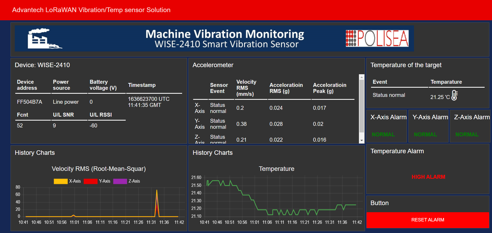

# Portfolio
---
## Monitoring, Controlling and Cost Management of Energy, Water and Gas consumption

### IoT Solution by LoRaWAN for [***McDonald’s restaurants***](https://www.mcdonalds.ro/restaurante)

Since last year, we have been working on a proof of concept. It was offered to McDonald's that they reduce their energy consumption. In addition, they consume other resources such as water, gas, etc. In one of their restaurants, we installed the LoRaWAN network. As a first step, we used five Eastron energy meters to collect energy-related data and observe the average consumption over twenty-four hours. By setting a threshold, if the energy consumption exceeds the limit, a mail notification will be sent if the consumption exceeds the limit. Customers will be informed about their unnecessary consumption by receiving this notification. By doing this, they can save 15% to 20% on their total energy costs. We use Thingsboard as a platform for the Internet of Things and LoRaWAN as a technology for sensor communications. In this year, they approved our proof of concept, and we are now working with their other restaurants in Romania

 

 

---
### Datalogging with ChirpStack, Node-RED, InfluxDB, Grafana using Docker Container

Rather than relying on cloud computing, I build a local solution for our customers. My first step was to install ChirpStack network server, Node-RED, Influx DB & Grafana as Docker containers on the Dell server. InfluxDB is used to create a database. I connect the Grafana web application to this database, which is an open-source analytics and monitoring solution. The ChirpStack network server receives all sensor values through a Microtik gateway. Through a topic provided by ChirpStack, Node-RED collects data from NS. After collecting those values I forward them to the InfluxDB database. By using these data, I built a simple web dashboard in Grafana to visualize the values in graphs, charts, and alerts for notification of critical situations.

 

 

---
### Advantech LoRaWAN WISE-6610 gateway and WISE-2410 wireless condition monitoring sensor solution

For predictive maintenance, I used WISE-2410 to transmit sensor data to WISE-6610 (via LoRaWAN) or a 3rd party LoRaWAN gateway (via LoRaWAN). WISE-6610 provides Ethernet connectivity and supports Modbus TCP, RESTful Web API for integration. The WISE-6610 allows for VPN tunnel creation with various protocols that ensure safe communication. It also provides a network server that can encrypt and convert LoRaWAN data in the device, and its redundancy-enhanced functions are specifically designed to prevent connection loss. It has an inbuilt application server. Using this application server, I built a dashboard in Node-RED to visualize the WISE-2410 values.

 

 

---
## DataBase

### Deploy PostgreSQL fully manageable database for Thingboard

ThingsBoard uses the database to store entities (devices, assets, customers, dashboards, etc) and telemetry data (attributes, timeseries sensor readings, statistics, events). In this project, I am preparing to deploy a PostgreSQL fully managed database. PostgreSQL is a free and open-source object-relation database management system (ORDBMS). ThingsBoard customers successfully use Azure Database for PostgreSQL to minimize efforts on database setup, backups and support.

 

 

---
### TEMPERATURE-MEASUREMENT-OF-SHEET-PACKAGES-AT-AXLE-ASSEMBLY

We have done a temperature measurement project for Cummins Generator Technologies Romania SA. During this project, we need to read the temperature range of the electric rotor between 100 °C and 200 °C. We use two sensors one is the position/distance sensor, and another one is the temperature sensor. When each rotor passes through the rays of the position/distance sensor, the temperature is checked. The green lamp illuminates when the temperature level is in the set range. In addition, the PLC logs data while the HMI shows the values.

 

 

 

---
### CAR RACING GAME BASED ON SCRATCH PROGRAMMING

In this project, I customize the backdrop using the stage tool from scratch programming settings. I have included three sprites to make the game more realistic. Users can select the up and down arrow key's to increase or decrease the speed of the car. They can use the right and left arrow key's to change the direction of the car.

 

 
  
--- 
## Filmed by me

Beside Engineering, I have a great passion for photography and videography. Below is a list of the videos I have created for sharing my knowledge.

 

- [How to install Node-RED on Ubuntu 20.04 with username and password authentication??](https://www.youtube.com/watch?v=Y2ttfN9mOyQ&t=10s)
- [Enable SSH on Ubuntu 20.04 step-by-step instruction and connect by Putty.](https://www.youtube.com/watch?v=_Rt7UzRbeV8)

---

© 2022 Ariful Islam Arif. Powered by Jekyll and the Minimal Theme.

